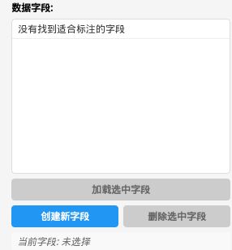
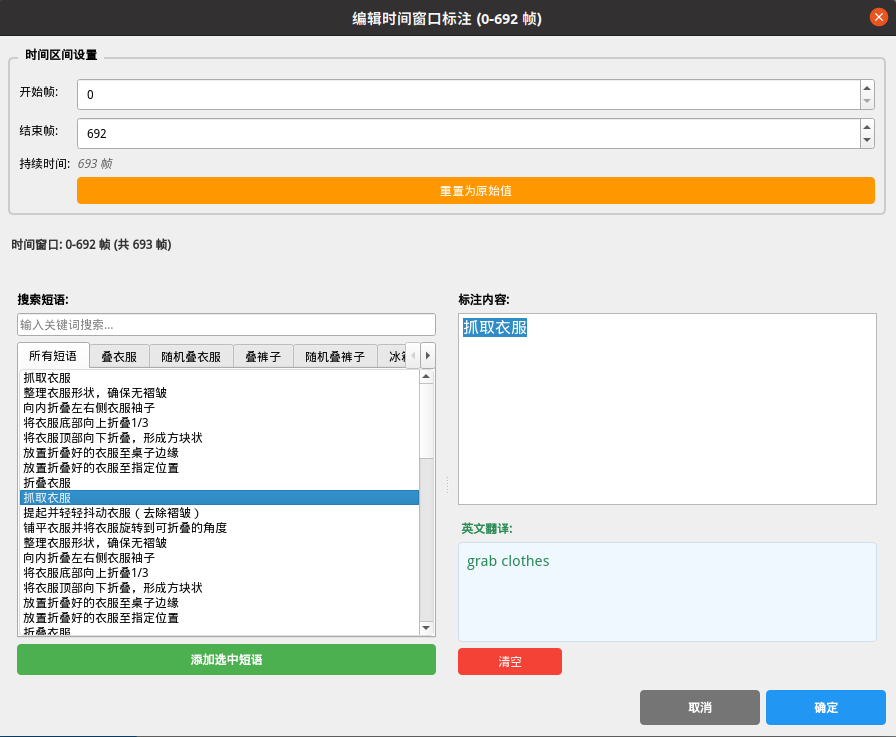
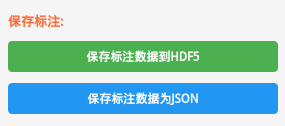
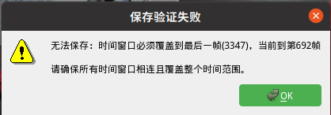

# HDF5视频标注工具使用教程

### 打开HDF5文件
1. 第一种方式:
   - 点击菜单栏的"打开文件"按钮
   - 在弹出的文件选择对话框中选择HDF5文件
   - 点击"Open"完成文件加载
2. 第二种方式（方便多个文件标注）:
   - 点击菜单栏的"打开文件夹"按钮
   - 在弹出的文件夹选择对话框中选择包含HDF5文件的文件夹
   - 点击"Choose"完成文件夹加载
   - 可以点击下一个文件进行批量标注

### 数据字段

- 支持进行多个字段的标注
1. 创建新字段:
   - 点击"创建新字段"按钮
   - 输入字段名称
   - 点击"OK"完成创建
2. 删除字段:
   - 选中要删除的字段
   - 点击"Yes"按钮
   - 确认删除操作
3. 选择当前字段:
   - 在字段列表中点击选择
   - 当前选中的字段会高亮显示
   - 所有标注操作都针对当前字段

### 创建时间窗口标注

1. 在时间轴上拖动红色竖线到目标位置
2. 点击"添加时间窗口"按钮
3. 程序会自动将时间窗口的结束时间设置为红色竖线处
4. 时间窗口会显示在标注列表中

### 时间窗口调整
- **拖拽边界**：直接拖拽时间窗口的左右边界进行调整
- **精确编辑**：双击时间窗口进行精确的时间范围编辑

### 编辑标注内容

1. 双击标注列表中的时间窗口
2. 在弹出的编辑对话框中：
   - 从短语库中选择预定义内容
   - 或直接输入自定义标注
   - 支持中英文双语输入
3. 点击"确定"保存标注

### 保存标注结果

1. 可选择保存为HDF5或JSON两种格式

### 保存标注结果检查

1. 程序会检查所有时间窗口是否相连并覆盖整个时间范围，不满足则不保存